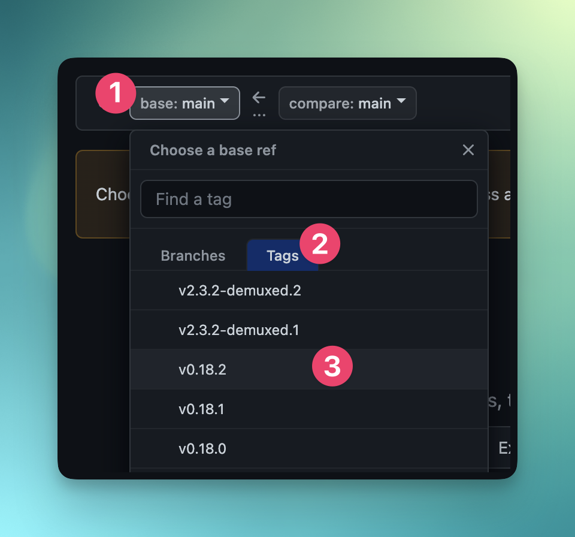
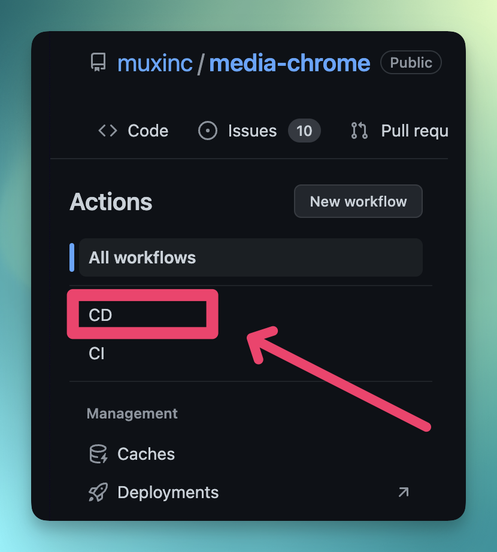
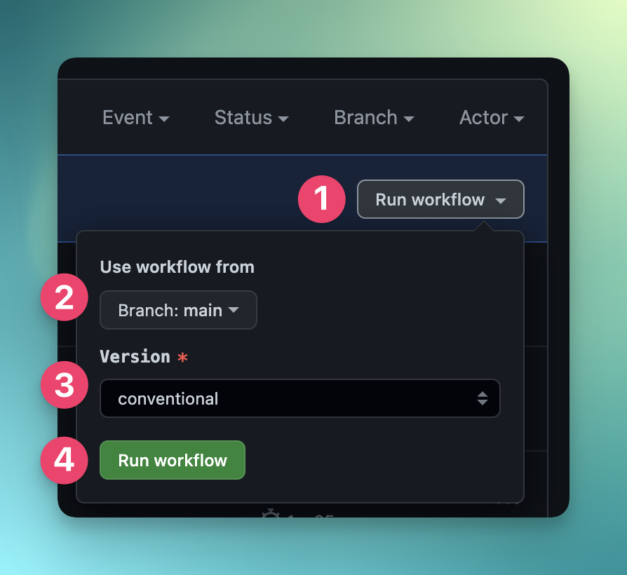

# Contributing to `<media-chrome>`

- [Questions](#questions)
- [Bugs and Issues](#issues)
- [Documentation Updates](#documentation)
- [Feature Requests](#features)
- [Submitting a Pull Request](#pull-requests)
- [Merging a Pull Request](#merging)
- [Releasing](#releasing)

## <a name="questions">Questions</a>

Have a question? Want to start a discussion? For now, you can simply [Open a New Discussion](https://github.com/muxinc/media-chrome/discussions/new), and choose a fitting category and title.

## <a name="issues">Bugs and Issues</a>

If you think you've found a bug, make sure you review and fill out a [Bug Report](https://github.com/muxinc/media-chrome/issues/new/choose) before starting any work. This will ensure for both yourself and the maintainers that the issue in question can be properly confirmed, reproduced, smoke tested, etc. Once done, if you want to try to fix the issue yourself, go ahead and follow our [Submitting a Pull Request](#pull-requests) guide. Contributions are welcome and encouraged!

## <a name="documentation">Documentation Updates</a>

Our documentation update request requirements are similar to the requirements for [Bugs and Issues](#issues).

## <a name="features">Feature Requests</a>

For feature requests, you can start by reviewing and filling out a [Feature Request](https://github.com/muxinc/media-chrome/discussions/new). Unlike bug fixes, Feature Requests will likely require more discussion from the maintainers, including whether or not it is consistent with our overall architectural goals, our timeline and priorities, and the like. Once done, assuming you've gotten a 👍 to work on the feature, go ahead and follow our [Submitting a Pull Request](#pull-requests) guide.

## <a name="pull-requests">Submitting a Pull Request</a>

Before submitting a pull request, make sure you've reviewed and filled out an appropriate [Issue](https://github.com/muxinc/media-chrome/issues/new/choose). We recommend doing this before starting any work, just in case an issue already exists, or it's unlikely the maintainers will be able to review the PR because it e.g. lacks sufficient reproduction steps. In addition, we recommend the following:

1. We use [conventional commits](https://www.conventionalcommits.org/en/v1.0.0/). Please try to prefix your commits according to the type of changes you're making, and try to be as descriptive as possible in your commit messages. For example:

- For Bug Fixes: `fix: foo by bar`
- For Features: `feat: add video feat`
- For Documentation Updates: `docs: update audio copy`

2. Make sure you base your branch off of the latest in `main`, e.g.

   ```shell
   git checkout -b my-fix-for-foo main
   ```

3. When issuing your Pull Request, be sure to [Link it to the corresponding issue(s)](https://docs.github.com/en/issues/tracking-your-work-with-issues/linking-a-pull-request-to-an-issue#linking-a-pull-request-to-an-issue-using-a-keyword)

4. Add any additional comments to your PR's description that will help the reviewer(s), such as call outs, open questions, areas that merit extra attention, etc.

5. When addressing any feedback, you can simply add it as new commits.

6. We use a [rebase strategy](https://docs.github.com/en/repositories/configuring-branches-and-merges-in-your-repository/configuring-pull-request-merges/configuring-commit-rebasing-for-pull-requests) when merging PR branches into `main`. If your branch has merge conflicts, if possible, please try to resolve them by doing a [`git rebase`](https://git-scm.com/docs/git-rebase) onto `main` and then doing a `git push --force-with-lease`. For example:

   ```shell
   git fetch upstream
   git rebase --onto main your-old-base my-fix-for-foo
   ... resolve any conflicts
   git push --force-with-lease
   ```

   (See the [git docs](https://git-scm.com/docs/git-rebase) for more details on `git rebase --onto`)

## <a name="merging">Merging a Pull Request (maintainers only)</a>

When you choose to squash and merge be sure to prefix the commit message
with `fix:`, `feat:` or similar according to 
[conventional commits](https://www.conventionalcommits.org/en/v1.0.0/).

## <a name="releasing">Releasing (maintainers only)</a>

### Short version (I've done this before!)
1. Visit the [GitHub Actions tab](https://github.com/muxinc/media-chrome/actions) and 
select the "CD" action in the left sidebar.
2. Click the "Run workflow" dropdown and choose the correct `Version` on the `main` branch.
   - In the **Use workflow from** select box, make sure **Branch: main** is selected.
   - In the **Version** select box, choose the appropriate value:
      - If the commit messages in this release were written using the correct conventional commit style, select `conventional`.  
      - If the commit messages aren't accurate, manually choose the correct semver version `patch`, `minor`, `major`.
3. When you're confident with your choices, click the green **Run workflow** button to start the release process.
4. After a few minutes, a new release will be published. This includes an NPM package, new version tags, and a GitHub release.

---
### Long version (I need more context!)

This repo uses [conventional commits](https://www.conventionalcommits.org/en/v1.0.0/)
and GitHub Actions for continuous deployment (CD).

> If you're unfamiliar with conventional commits, it's a good idea to review the link above before continuing.

Here's a quick summary of how we use conventional commits in this repository:

- Commit messages prefixed with `fix:` will notify CD that the release is minimally a `patch` release.
- Commit messages prefixed with `feat:` will notify CD that the release is minimally a `minor` release.
- Commit messages containing `BREAKING CHANGE` in the footer will notify CD that the release is minimally a `major` release.
- All other conventional commits have no impact on the versioning.
### Review commit messages since last release
To proceed with a release, you should be confident that the commits in your upcoming release accurately reflect the type of version that you intend to release.

Here's how you can review the commits you're about to release:



1. Visit https://github.com/muxinc/media-chrome/compare
2. In the **base** select box, choose the tag applied to the previous release. Keep `main` for the **compare** select box value.
3. Review the list of commits to see if they are appropriately using conventional commits.

> Note: if you're uncertain about particular commits, you may want to reach out to the author of said commit(s) for clarity

### Steps to release a new version



1. Visit the [GitHub Actions tab](https://github.com/muxinc/media-chrome/actions) and 
select the "CD" action in the left sidebar.



2. Click the "Run workflow" dropdown and choose the correct `Version` on the `main` branch.
   - In the **Use workflow from** select box, make sure **Branch: main** is selected.
   - In the **Version** select box, choose the appropriate value:
      - If the commit messages in this release were written using the correct conventional commit style, select `conventional`.  
      - If the commit messages aren't accurate, manually choose the correct semver version `patch`, `minor`, `major`.
3. When you're confident with your choices, click the green **Run workflow** button to start the release process.
4. After a few minutes, a new release will be published. This includes an NPM package, new version tags, and a GitHub release.
5. That's it! Nice work.
