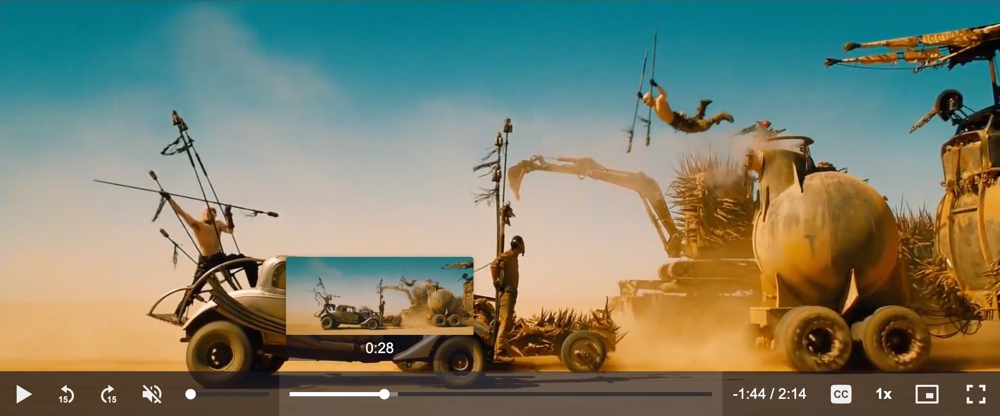

<h1>
  <a href="https://media-chrome.org" target="_blank">
    <picture>
      <source media="(prefers-color-scheme: dark)" srcset="docs/public/media-chrome-logo-dark.svg">
      <source media="(prefers-color-scheme: light)" srcset="docs/public/media-chrome-logo-light.svg">
      
    </picture>
  </a>
</h1>

[](https://www.npmjs.com/package/media-chrome) 
[](https://www.npmjs.com/package/media-chrome) 
[](https://www.jsdelivr.com/package/npm/media-chrome)
[](https://bundlephobia.com/result?p=media-chrome) 
[](https://www.video-dev.org/)

Your media player's dancing suit. :man_dancing:

Fully customizable media player controls using web components (native custom elements).

- [x] Compatible with any javascript framework (React, Angular, Svelte, etc.)
- [x] Compatible with the `<video>` and `<audio>` elements and [a lot of players](https://www.media-chrome.org/docs/en/media-element#compatible-media-elements) (YouTube, HLS.js, and more)
- [x] Simple HTML to add/remove controls
- [x] Simple CSS to style the controls

_From [Mux](https://mux.com?utm_source=github&utm_medium=social&utm_campaign=media-chrome) and the creator of [Video.js](https://videojs.com/)._

## Documentation

Visit the [official documentation for Media Chrome](https://media-chrome.org/docs) for the latest up-to-date usage instructions.

You can find the [documentation for v0.x of media-chrome here.](https://v0.media-chrome.org/en/get-started)

## Examples

<a href="https://media-chrome.mux.dev/examples/vanilla/" target="_blank">See all of the repo examples in action.</a>

### Video Example

```html
<script type="module" src="https://cdn.jsdelivr.net/npm/media-chrome@4/+esm"></script>

<media-controller>
  <video
    slot="media"
    src="https://stream.mux.com/DS00Spx1CV902MCtPj5WknGlR102V5HFkDe/high.mp4"
    crossorigin
  >
    <track
      label="thumbnails"
      default
      kind="metadata"
      src="https://image.mux.com/DS00Spx1CV902MCtPj5WknGlR102V5HFkDe/storyboard.vtt"
    />
  </video>
  <media-control-bar>
    <media-play-button></media-play-button>
    <media-mute-button></media-mute-button>
    <media-volume-range></media-volume-range>
    <media-time-range></media-time-range>
    <media-pip-button></media-pip-button>
    <media-fullscreen-button></media-fullscreen-button>
  </media-control-bar>
</media-controller>
```

#### Results (<a href="https://codepen.io/heff/pen/ZEGdBzN?editors=1000" target="_blank">Try the CodePen example</a>)

<a href="https://codepen.io/heff/pen/ZEGdBzN?editors=1000" target="_blank">
  
</a>

### Audio Example

```html
<script type="module" src="https://cdn.jsdelivr.net/npm/media-chrome@4/+esm"></script>

<media-controller audio>
  <audio
    slot="media"
    src="https://stream.mux.com/O4h5z00885HEucNNa1rV02wZapcGp01FXXoJd35AHmGX7g/audio.m4a"
  ></audio>
  <media-control-bar>
    <media-play-button></media-play-button>
    <media-time-display showduration></media-time-display>
    <media-time-range></media-time-range>
    <media-playback-rate-button></media-playback-rate-button>
    <media-mute-button></media-mute-button>
    <media-volume-range></media-volume-range>
  </media-control-bar>
</media-controller>
```

#### Results (<a href="https://codepen.io/heff/pen/wvdyNWd?editors=1000" target="_blank">Try the CodePen example</a>)

<a href="https://codepen.io/heff/pen/wvdyNWd?editors=1000" target="_blank">
  
</a>

## Use with React

While you technically can use Media Chrome elements directly with React, it can sometimes be a bit clunky to work with Web Components in React, and some things just don't feel idiomatic to the framework (for example: having to use `class=` instead of `className=`, see [React's official docs regarding web components](https://react.dev/reference/react-dom/components#custom-html-elements) for more details). To help with this, we've published some React wrapper components for all of our core Elements. You can read up on using them [here](https://www.media-chrome.org/docs/en/react/get-started).

## Why?

More often than not web designers and developers just use the default media player controls, even when creating a beautiful custom design theme. It's hard not to.

- Web browsers have built-in media controls that can't easily be customized and look different in every browser.
- Social sites like Youtube, Vimeo, and SoundCloud only let you customize small details of the player, like primary button color.
- Media controls are complex and hard to build from scratch. Open source players like Video.js and JW Player help, but require you to learn proprietary JS APIs, and can be difficult to use with popular Javascript frameworks.

It should be easier... `<media-chrome>` is an attempt at solving that.

## Why now?

Web components. @heff spoke about [the potential of web components for video](https://youtu.be/TwnygSWmToc?t=859) at Demuxed 2015, and [again in 2020](https://www.youtube.com/watch?v=qMcNDWyRw20). They allow us to extend the browser's base HTML functionality, meaning we can now build media player controls as simple HTML tags that:

- Can be used like any native HTML tag in HTML, Javascript, and CSS (unleash your designer)
- Are compatible by default with Javascript frameworks (React, Angular, Svelte)
- Can be used across players when using multiple in the same site, e.g Youtube & `<video>`. (Could even be used by players as their own built-in controls)

## Core Concepts

- [Design Principles](https://www.media-chrome.org/docs/en/design-principles)
- [Architecture](https://www.media-chrome.org/docs/en/architecture)
