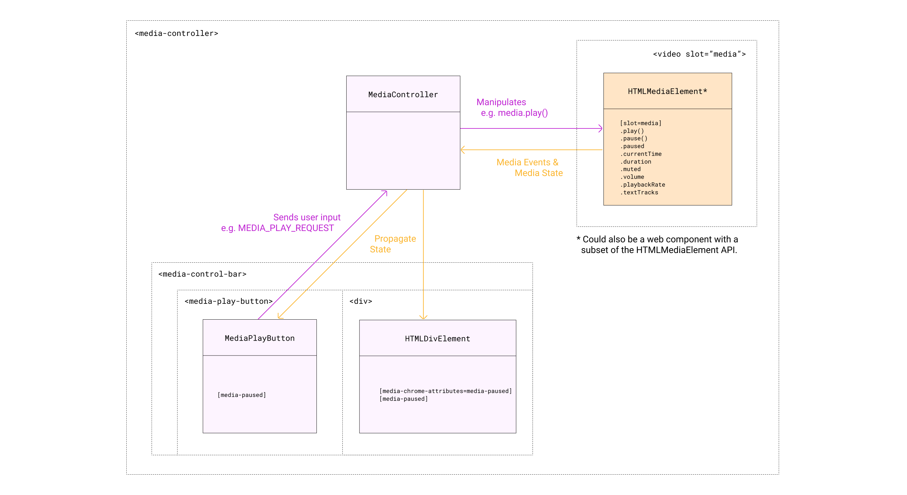
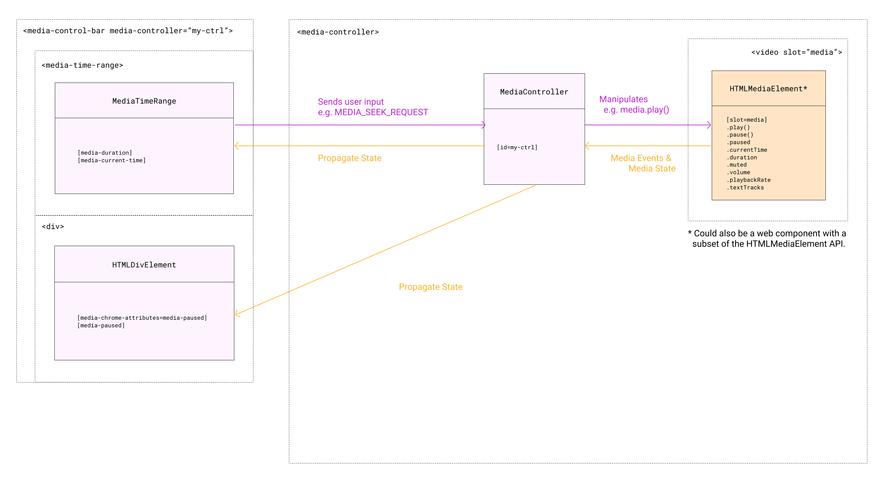

Media Chrome - Architecture
===========================

Any control element can *send* user input to the [`MediaController`](https://github.com/muxinc/media-chrome/blob/main/src/js/media-controller.js#L33) and *receive* media state from the `MediaController`.

### Sending

The `MediaController` receives user input via [`MediaUIEvents`](https://github.com/muxinc/media-chrome/blob/main/src/js/constants.js#L1) like `MediaUIEvents.MEDIA_PLAY_REQUEST` or `MediaUIEvents.MEDIA_SEEK_REQUEST`. The `MediaController` may receive these events in one of two ways:

- From a control element that is nested under the `<media-controller>` element (see [diagram 1](#1-by-media-controller-nesting)).  
  The DOM element that will receive bubbling up events from the control element is the `<media-controller>` element, it's also called an **associated element** in the codebase.

- From a control element that is **not** nested under the `<media-controller>` element (see [diagram 2](#2-by-media-controller-id)).  
  An **associated element** is created by targeting the media controller via the `media-controller` attribute or property. 

  ```html
  <media-controller id="my-ctrl">
    <video slot="media"></video>
  </media-controller>

  <media-play-button media-controller="my-ctrl"></media-play-button>
  ```

  Now the DOM events are received by the **associated element** and passed through to the `MediaController`.

  All Media Chrome elements support the `media-controller` attribute and can be made an **associated element**.  
  Simple HTML elements can be made associated elements but require some [JavaScript](https://github.com/muxinc/media-chrome/blob/main/src/js/media-control-bar.js#L60-L64) to get this to work.

### Receiving

The `MediaController` propagates media state by setting `MediaUIAttributes` on observing DOM elements.

Any **associated element** or any of its descendants can receive media state from the `MediaController`, as long as the elements are identifiable as something that should receive media state (aka identifiable as a **media state receiver**). Elements are identified as media state receivers in one of two ways:

- The native Media Chrome web components will have this built in and they do this by having the [`MediaUIAttributes`](https://github.com/muxinc/media-chrome/blob/main/src/js/constants.js#L24) listed in the web component `observedAttributes` array.

  ```js
  class MediaPlayButton extends MediaChromeButton {
    static get observedAttributes() {
      return [...super.observedAttributes, MediaUIAttributes.MEDIA_PAUSED];
    }
  }
  ```

- Simple HTML elements like a `<div>` element for example are also able to receive media state by defining a `media-chrome-attributes` attribute and listing the `MediaUIAttributes` space separated.

  ```html
  <div media-chrome-attributes="media-paused media-current-time"></div>
  ```
  
<br>
<br>

### 1\. by `<media-controller>` Nesting




[View Figma embed](https://www.figma.com/embed?embed_host=share&url=https%3A%2F%2Fwww.figma.com%2Ffile%2FJfpS4VVSJgvywPHEYAr7Ie%2FMedia-Chrome-Diagrams%3Fnode-id%3D0%253A1)
  
<br>
<br>

### 2\. by `<media-controller>` ID



[View Figma embed](https://www.figma.com/embed?embed_host=share&url=https%3A%2F%2Fwww.figma.com%2Ffile%2FJfpS4VVSJgvywPHEYAr7Ie%2FMedia-Chrome-Diagrams%3Fnode-id%3D26%253A84)
