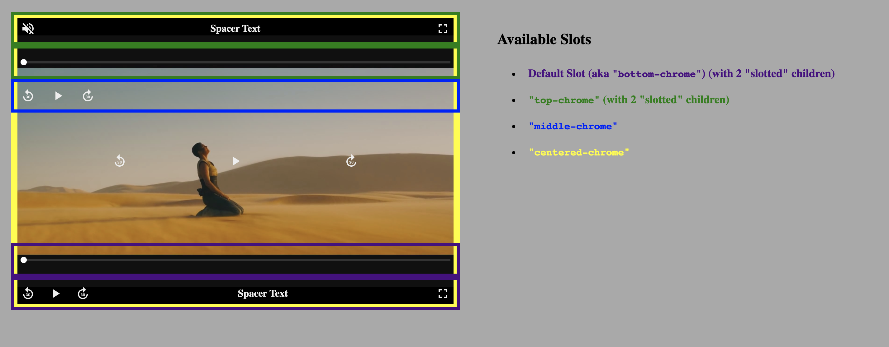
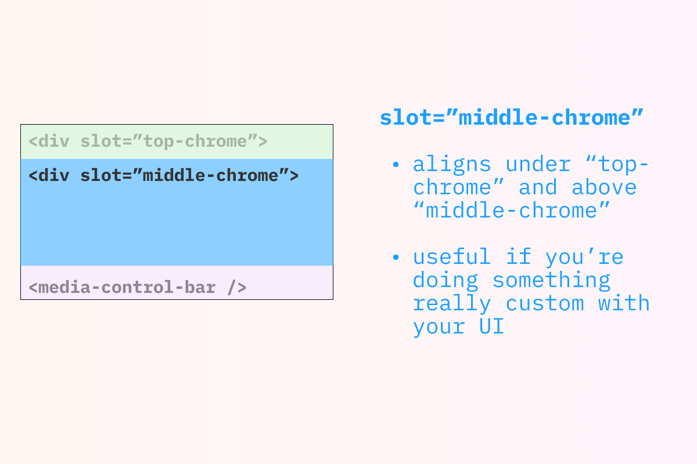
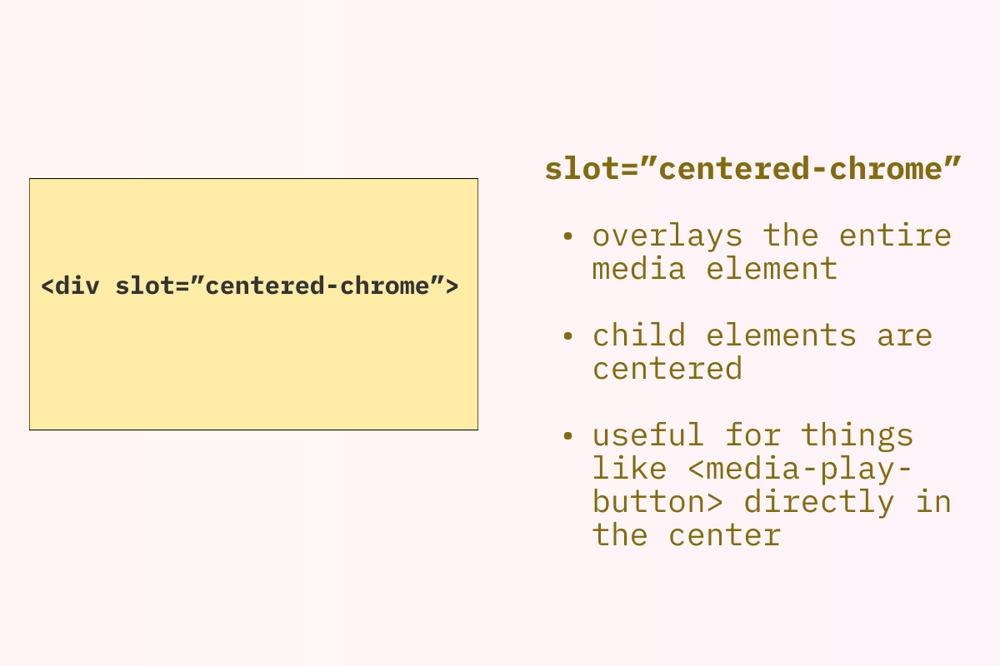

# `<media-controller/>`

The `<media-controller/>` manages communication of state and state change requests between a `media` element and control elements. It also provides some built in sizing and layout to make styling your player as easy as possible.

# Attributes

- `autohide (seconds, default: 0)` - (`video` only) Use this to autohide all controls/chrome (except for the `media`) after `n` seconds of inactivity, unless the media is paused. To disable `autohide`, set the value to -1.

Example:

```html
<media-controller autohide="2">
  <video
    slot="media"
    src="https://stream.mux.com/DS00Spx1CV902MCtPj5WknGlR102V5HFkDe/high.mp4"
  ></video>
  <div slot="centered-chrome">
    <media-seek-backward-button></media-seek-backward-button>
    <media-play-button></media-play-button>
    <media-seek-forward-button></media-seek-forward-button>
  </div>
  <media-control-bar class="seek-control-bar">
    <media-time-range></media-time-range>
    <media-time-display show-duration remaining></media-time-display>
  </media-control-bar>
  <media-control-bar>
    <media-mute-button></media-mute-button>
    <media-playback-rate-button></media-playback-rate-button>
    <media-pip-button></media-pip-button>
    <media-fullscreen-button></media-fullscreen-button>
  </media-control-bar>
</media-controller>
```


Example (`autohide` disabled):

```html
<media-controller autohide="-1">
  <video
    slot="media"
    src="https://stream.mux.com/DS00Spx1CV902MCtPj5WknGlR102V5HFkDe/high.mp4"
  ></video>
  <div slot="centered-chrome">
    <media-seek-backward-button></media-seek-backward-button>
    <media-play-button></media-play-button>
    <media-seek-forward-button></media-seek-forward-button>
  </div>
  <media-control-bar class="seek-control-bar">
    <media-time-range></media-time-range>
    <media-time-display show-duration remaining></media-time-display>
  </media-control-bar>
  <media-control-bar>
    <media-mute-button></media-mute-button>
    <media-playback-rate-button></media-playback-rate-button>
    <media-pip-button></media-pip-button>
    <media-fullscreen-button></media-fullscreen-button>
  </media-control-bar>
</media-controller>
```

# Styling

- `aspect-ratio` - While this is [a standard CSS style](https://css-tricks.com/almanac/properties/a/aspect-ratio/), it's fairly new, and you're likely to want to use it frequently on `<media-controller/>`, at least for `video` use cases. Most often, you'll want the `aspect-ratio` to match your video content's aspect ratio.

Example:

```html
<media-controller style="aspect-ratio: 16/9">
  <video
    slot="media"
    src="https://stream.mux.com/BlSb4AuUfA00wchgJ3D00bz4VTppg3eo5Y/high.mp4"
    poster="https://image.mux.com/BlSb4AuUfA00wchgJ3D00bz4VTppg3eo5Y/thumbnail.jpg"
    muted
    preload="none"
    crossorigin
  ></video>
  <media-control-bar>
    <media-play-button></media-play-button>
    <media-mute-button></media-mute-button>
    <media-volume-range></media-volume-range>
    <media-time-display></media-time-display>
    <media-time-range></media-time-range>
    <media-duration-display></media-duration-display>
    <media-playback-rate-button></media-playback-rate-button>
    <media-fullscreen-button></media-fullscreen-button>
  </media-control-bar>
</media-controller>
```

Just in case your browser doesn't support `aspect-ratio` (all major evergreen browsers should!), you can always set it manually.

```html
<media-controller style="width: 800px; height: calc(800px * 9/16)">
  <!-- for 16:9 aspect ratio where you want an explicit width and a "derived" height -->
  <video
    slot="media"
    src="https://stream.mux.com/BlSb4AuUfA00wchgJ3D00bz4VTppg3eo5Y/high.mp4"
    poster="https://image.mux.com/BlSb4AuUfA00wchgJ3D00bz4VTppg3eo5Y/thumbnail.jpg"
    muted
    preload="none"
    crossorigin
  ></video>
  <media-control-bar>
    <media-play-button></media-play-button>
    <media-mute-button></media-mute-button>
    <media-volume-range></media-volume-range>
    <media-time-display></media-time-display>
    <media-time-range></media-time-range>
    <media-duration-display></media-duration-display>
    <media-playback-rate-button></media-playback-rate-button>
    <media-fullscreen-button></media-fullscreen-button>
  </media-control-bar>
</media-controller>
```

# Layout - Slots

Slots are used to tell `<media-controller/>` where you want your controls positioned. Even if you aren't explicitly naming a slot, you're still using one (the "default slot"). Most commonly, you'll put media control elements like `<media-play-button/>` or `<media-fullscreen-button/>` inside slots. But any arbitrary markup can be placed inside a slot.

This gives you a lot of flexibility when customizing your player. For example, here is a player that has an h3 title in the top slot and a play button in the centered slot.

```html
<media-controller>
  <video slot="media"></video>
  <div slot="top-chrome">
    <h3>Episode 2</h3>
  </div>
  <div slot="centered-chrome">
    <media-play-button></media-play-button>
  </div>
</media-controller>
```

You also may want to show different slots on mobile vs. desktop. For example, here's a player that uses `slot="centered-chrome"` on mobile and uses a `<media-control-bar/>` in the default slot (aka "`bottom-chrome`") on desktop:

```html
<style>
  .desktop {
    display: none;
  }
  @media (min-width: 768px) {
    .mobile {
      display: none;
    }
    .desktop {
      display: block;
    }
  }
</style>

<media-controller>
  <video slot="media"></video>
  <div slot="top-chrome">
    <h3>Episode 2</h3>
  </div>
  <div slot="centered-chrome" class="mobile">
    <media-play-button></media-play-button>
  </div>
  <media-control-bar class="desktop">
    <!-- This will go in the default slot, effectively the "bottom-chrome" -->
    <media-play-button></media-play-button>
  </media-control-bar>
</media-controller>
```

Below is a more in-depth discussion of available slots and how they work.

(**NOTE**: slots are actually [part of the Web Components / Custom Elements specification](https://developer.mozilla.org/en-US/docs/Web/Web_Components/Using_templates_and_slots), but you shouldn't need to understand these technical details to work with them in `<media-chrome/>`)

## Working with slots (video)



For an interactive example of how each of the slots render for `video`, check out [this demo](https://media-chrome.mux.dev/examples/slots-demo.html) ([view source](https://github.com/muxinc/media-chrome/blob/main/examples/slots-demo.html)).

### Default Slot (effectively the "`bottom-chrome`")

<br>

<br>
<br>

- Render Location: Each child that doesn't specify a slot will render at the bottom of the `<media-controller/>`. If you have more than one element like this they will be stacked vertically.

- Common/Example use cases: showing one or more rows of controls at the bottom of the `<media-controller/>`. For many use cases, you can simply add a `<media-control-bar/>` for each row of controls you'd like, which will provide you with additional automatic sizing and layout behavior.
  - [Basic example](https://media-chrome.mux.dev/examples/basic.html) ([view source](https://github.com/muxinc/media-chrome/blob/main/examples/basic.html))
  - [Mobile example](https://media-chrome.mux.dev/examples/mobile.html) ([view source](https://github.com/muxinc/media-chrome/blob/main/examples/mobile.html))
  - [Youtube theme](https://media-chrome.mux.dev/examples/themes/youtube-theme.html) ([view source](https://github.com/muxinc/media-chrome/blob/main/examples/themes/youtube-theme.html))
  - [Netflix theme](https://media-chrome.mux.dev/examples/themes/netflix-theme.html) ([view source](https://github.com/muxinc/media-chrome/blob/main/examples/themes/netflix-theme.html))

### `top-chrome`

<br>

<br>
<br>

- Render Location: Each child that specifies `slot="top-chrome"` will render at the top of the `<media-controller/>`. If you have more than one element like this they will be stacked vertically.

- Common/Example use cases: showing one or more rows of controls at the top of the `<media-controller/>`. For many use cases, you can simply add a `<media-control-bar/>` for each row of controls you'd like.
  - [Demuxed 2021 theme](https://media-chrome.mux.dev/examples/themes/demuxed-2021-theme.html) (mobile screen sizes only) ([view source](https://github.com/muxinc/media-chrome/blob/main/examples/themes/demuxed-2021-theme.html))

### `middle-chrome`

<br>

<br>
<br>

- Render Location: Children that specify `slot="middle-chrome"` will show up in the available space between any "`top-chrome`" children and any default slot/"`bottom-chrome`" children.

- Common/Example use cases: `middle-chrome` would generally be used for more specific cases, such as custom subtitle/caption rendering, or additional related content you'd like to show while the media is paused or has finished playback. While you **_can_** have multiple children that are "slotted to" `middle-chrome`, most likely, you'll want to use one and style it to size/layout any custom content you'd like.
  - (Examples coming!)

### `centered-chrome`

<br>

<br>
<br>

- Render Location: The child that specifies `slot="centered-chrome"` will show up in the center of the `<media-controller/>` and will be "above" anything in the default slot, `top-chrome`, or `middle-chrome`.

- Common/Example use cases: "big button" controls that are centered and horizontally layed out "on top of" the media. While you **_can_** have multiple children that are "slotted to" `centered-chrome`, most likely, you'll want to use only one, making styling and layout easier and more predictable.
  - [Mobile example](https://media-chrome.mux.dev/examples/mobile.html) ([view source](https://github.com/muxinc/media-chrome/blob/main/examples/mobile.html))
  - [Demuxed 2021 theme](https://media-chrome.mux.dev/examples/themes/demuxed-2021-theme.html) ([view source](https://github.com/muxinc/media-chrome/blob/main/examples/themes/demuxed-2021-theme.html))

### Other use cases

<figure>

<figcaption>Mix and match your use of slots (e.g. using <code>&lt;media-control-bar/&gt;</code> at the top and bottom)</figcaption>
</figure>

<br>

<figure>

<figcaption>Use media queries for desktop-only or mobile-only controls, just like any HTML element</figcaption>
</figure>

## Working with slots (audio)

Since `audio` chromes vary much more than `video`, it's recommended that you only use the default slot and only add a single element (e.g. a single `<media-control-bar/>`) and style it however you'd like.

As we work through other common use cases, both internally and with the community, we may start adding additional "built-in" styling and layout for `<media-control-bar/>` slots used with `audio`.

- Example use cases:
  - [Basic example](https://media-chrome.mux.dev/examples/basic.html) ([view source](https://github.com/muxinc/media-chrome/blob/main/examples/basic.html))
  - [Spotify theme](https://media-chrome.mux.dev/examples/themes/spotify-theme.html) ([view source](https://github.com/muxinc/media-chrome/blob/main/examples/themes/spotify-theme.html))
