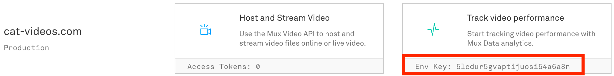

# Introduction

`<mux-video></mux-video>` is a Mux-flavored HTML5 video element.

If you are familiar with using `<video />` + [Hls.js](https://github.com/video-dev/hls.js) in your application, then you'll feel right at home with this web component.

# Installation

If you're using `npm` or `yarn`, install that way:

## Package manager


```
yarn add @mux-elements/mux-video
```

or

```
npm i @mux-elements/mux-video
```

Then, import the library into your application with either `import` or `require`:

```js
import '@mux-elements/mux-video'
```

or

```js
require('@mux-elements/mux-video')
```

## CDN option

Alternatively, use the CDN hosted version of this package:

```html
<script src="https://unpkg.com/@mux-elements/mux-video@0.1.0/index.js"></script>
```

## Features and benefits

Without `<mux-video>` if you want to use the browser built-in HTML5 video element for playback you would have to wire up [Hls.js](https://github.com/video-dev/hls.js) and [Mux Data](https://docs.mux.com/guides/data/monitor-hls-js) yourself.

`<mux-video>` will automatically handle recoverable errors that happen during video playback. This is particularly handy for live streams that may experience disconnects. 

`<mux-video>` will use the optimial Hls.js settings for Mux Video so you don't have to worry about that. `<mux-video>` will also periodically test new versions of Hls.js and upgrade to known stable versions so you don't have to worry about upgrading to a new version of Hls.js yourself.

## Usage

Loading this library in the browser will register a [custom web component](https://developer.mozilla.org/en-US/docs/Web/Web_Components) for `<mux-video>`.

Now you are free to use this web component in your HTML, just as you would with the HTML5 `<video>` element.

```html
<body>
  <p></p>

  <mux-video
    playback-id="DS00Spx1CV902MCtPj5WknGlR102V5HFkDe?foo=bar&biz=baz"
    env-key="mux-data-env-key"
    metadata-video-title="Big Buck Bunny"
    metadata-viewer-user-id="user-id-1234"
    controls
  ></mux-video>
</body>
```

Attributes:

* `playback-id`: This is the playback ID for your Mux Asset or Mux Live Stream. The playback-id is the variable you may have used before to construct a `.m3u8` hls url like this:`https://stream.mux.com/{PLAYBACK_ID}.m3u8`. [Mux Docs](https://docs.mux.com/guides/video/play-your-videos#1-get-your-playback-id) 
* `env-key`: This is the environment key for Mux Data. Note that this is different than your API Key. Get your env key from the "Mux Data" part of the Mux Dashboard 

</img>

* `metadata-video-title`: This is an arbitrary title for your video that will be passed in as metadata into Mux Data. Adding a title will give you useful context in your Mux Data dashboard. (optional, but encouraged)
* `metadata-viewer-user-id`: If you have a logged-in user this should be an anonymized ID value that maps back to the user in your database. Take care to not expose personal identifiable information like names, usernames or email addresses. (optional, but encouraged)
* `metadata-video-id`: This is an arbitrary ID that should map back to a record of this video in your database. If not provided then the `playback-id` will be used for this value.

This is the bare bones of metadata that you should provide to the `<mux-video>` element.

All the other attributes that you would use on a `<video>` element like `poster`, `controls`, `muted` and `autoplay` are available and will work the same as they do with the HTML5 video element. One sidenote about `autoplay` though -- [read this to understand why that might not always work as expected](https://docs.mux.com/guides/video/web-autoplay-your-videos).

### Advanced: more metadata

To go above and beyond `metadata-*` attributes 

To set other available metadata fields use the `metadata` property on the `<mux-video>` element like so:

```html
<mux-video
  playback-id="DS00Spx1CV902MCtPj5WknGlR102V5HFkDe"
  env-key="mux-data-env-key"
  metadata-video-title="Big Buck Bunny"
  metadata-viewer-user-id="user-id-1234"
  controls
>
</mux-video>

<script>
  const muxVideo = document.querySelector('mux-video');
  muxVideo.metadata = {
    experiment_name: 'landing_page_v3',
    video_content_type: 'clip',
    video_series: 'season 1',
  };
</script>

```

Instead of using the `metadata` property, you also have the option to specify a remote URL for fetching metadata asynchronously. In the example below you would have an API server running at `https://api.myapp.com/` and the specified endpoint should respond with JSON  in the form of something like this:

```json
{
  "experiment_name": "landing_page_v3",
  "video_content_type": "clip",
  "video_series": "season 1"
}
```

When `metadata-url` is specified then `<mux-video>` will asychronously fetch the extra metadata without blocking the initial startup time.

```html
<mux-video
  playback-id="DS00Spx1CV902MCtPj5WknGlR102V5HFkDe"
  env-key="mux-data-env-key"
  metadata-video-title="Big Buck Bunny"
  metadata-viewer-user-id="user-id-1234"
  metadata-url="https://api.myapp.com/v1/metadata-endpoint.json"
  controls
>
</mux-video>
```

Take a look at the [metadata guide](https://docs.mux.com/guides/data/make-your-data-actionable-with-metadata) to view an exhaustive list of available values.

### Advanced: prefer-native

By default `<mux-video>` will use Hls.js if the browser supports [Media Source Extension](https://developer.mozilla.org/en-US/docs/Web/API/Media_Source_Extensions_API). This includes using Hls.js in Mac OS Safari.

If you prefer to use the browser-native Hljs engine whenever possible then pass in the `prefer-native` attribute.

```html
<mux-video
  playback-id="DS00Spx1CV902MCtPj5WknGlR102V5HFkDe"
  env-key="mux-data-env-key"
  metadata-video-title="Big Buck Bunny"
  metadata-viewer-user-id="user-id-1234"
  prefer-native
  controls
>
</mux-video>
```

### Advanced: Signed URLs and other playback query params

Mux supports a number of query parameters on HLS playback URLs. Most commonly is the `token=` param [used for signed URLs](https://docs.mux.com/guides/video/secure-video-playback).

In order to use `token=` -- or any other query params, pass them through with the `playback-id` attribute:

```
playback-id="DS00Spx1CV902MCtPj5WknGlR102V5HFkDe?token=jwt-signed-token"
```

# FAQ

### If I'm using Mux, do I have to use this library?

No, not at all! The way Mux delivers HLS video is compliant with the HLS spec. Any video player that supports HLS will work with Mux Video.

### If I'm not use Mux Video, can I still use this library?

You sure can! Instead of passing in `playback-id=""` attribute, pass in `src=""` with an HLS url. You can still use `env-key=""` to get all the features of Mux Data with your non-Mux video.
